# 👋 Welcome to my GitHub!

  

## 🚀 About Me

I'm **Leano Guerreiro**, a Backend Studant with a research-driven focus on AI, Computer Vision and Neuromorphic Computing.

🎓 **7th semester** - Information Systems @ [UFAM](https://ufam.edu.br/) (Federal University of Amazonas) 🇧🇷 
🧠 Research focus: **Deep Learning, Computer Vision & Neuromorphic Computing**  
⚙️ Engineering: **Scalable Backend Solutions** with Python  

## 💡 Fields of Interest

<table>
  <tr>
    <td width="50%" align="center">
      
    </td>
    <td width="50%">
       
      🐍 <strong>Python Development</strong> 
      Scientific computing, backend systems
        
      🧠 <strong>Deep Learning</strong> 
      PyTorch, model optimization, deployment
        
      🔮 <strong>Neuromorphic Computing</strong> 
      SNNs, event-based processing, brain-inspired AI
        
      👁️ <strong>Computer Vision</strong> 
      Image processing, object detection, visual AI
        
      ⚙️ <strong>Backend Engineering</strong> 
      APIs, microservices, ML deployment
       
    </td>
  </tr>
</table>

## 🔬 Research Interests

- **Spiking Neural Networks (SNNs)** and neuromorphic architectures
- **Event-based vision** and temporal processing
- **Representation learning** in bio-inspired systems
- **Efficient AI** for edge computing and embedded systems

## 🛠️ Tech Stack

<table>
  <tr>
    <td align="center" width="33%">
      <h3>Languages & Frameworks</h3>
       
       
       
      
    </td>
    <td align="center" width="33%">
      <h3>AI & Data Science</h3>
       
       
       
      
    </td>
    <td align="center" width="33%">
      <h3>Tools & Environment</h3>
       
       
       
      
    </td>
  </tr>
</table>

## 📌 Featured Projects

<table>
<tr>
<td width="50%">

### 🧠 [Skills Classification - Deep Learning](https://github.com/leanoguerreiro/skills-classification-deeplearning)
**Field:** Deep Learning | **Stack:** PyTorch, scikit-learn

This repository contains a deep learning pipeline for classifying brain tumors from MRI images. The pipeline is designed for experimentation with various pre-trained models, data augmentation techniques (including Gaussian noise), and robustness testing on noisy validation sets using k-fold cross-validation.

**Key techniques:** Transfer learning, text embeddings, model evaluation

</td>
<td width="50%">

### ⚙️ [Interactive Process Scheduler Evaluator](https://github.com/leanoguerreiro/avaliador-de-escalonamento-de-processos-interativos)
**Field:** Operating Systems | **Stack:** Python

This repository deals with the scheduling of interactive processes in operating systems, focusing on the analysis and implementation of a simulator that allows studying the behavior of different scheduling algorithms.

**Key features:** Algorithm benchmarking, visual analytics, performance profiling

</td>
</tr>
</table>

> 💡 *Combining theoretical research with practical engineering to build intelligent, scalable systems*

## 📊 GitHub Statistics

  

## 🎯 Current Focus

- 🔬 Researching **Spiking Neural Networks** for energy-efficient AI
- 🔭 Building **Computer Vision** pipelines for real-time applications  
- 💼 Deploying **ML models** as production-grade REST APIs
- 📚 Exploring **neuromorphic frameworks** (Norse, Brian2, BindsNET, SnnTorch and SpikingJelly)

## 📫 Let's Connect!

  

---

  
  
  
<em>🧠 Forged in chrome and code by <a href="https://github.com/leanoguerreiro">leanoguerreiro</a> ⚡</em>

  
Research-Driven Engineer · Backend · Computer Vision · Neuromorphic AI

